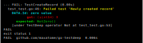

go-testdeep
===========

[](https://travis-ci.org/maxatome/go-testdeep)
[](https://coveralls.io/github/maxatome/go-testdeep?branch=master)
[](https://goreportcard.com/report/github.com/maxatome/go-testdeep)
[](https://godoc.org/github.com/maxatome/go-testdeep)
[](https://github.com/maxatome/go-testdeep/releases)
[](https://github.com/avelino/awesome-go/#testing)


**Extremely flexible golang deep comparison, extends the go testing package.**

- [Latest news](#latest-news)
- [Synopsis](#synopsis)
- [Godoc table of contents](docs/toc.md#godoc-table-of-contents)
- [Installation](#installation)
- [Presentation](#presentation)
- [Available operators](#available-operators)
- [Helpers](#helpers)
  - [`tdhttp` or HTTP API testing helper](#tdhttp-or-http-api-testing-helper)
- [Environment variables](#environment-variables)
- [Operators vs go types](#operators-vs-go-types)
- [See also](#see-also)
- [License](#license)
- [FAQ](docs/FAQ.md)


## Latest news

- 2019/09/22: new
  [`BeLax` feature](https://godoc.org/github.com/maxatome/go-testdeep#T.BeLax)
  with its [`Lax`] operator counterpart (and its friends
  [`CmpLax`](https://godoc.org/github.com/maxatome/go-testdeep#CmpLax)
  &
  [`T.CmpLax`](https://godoc.org/github.com/maxatome/go-testdeep#T.CmpLax));
- 2019/07/07: multiple changes occurred:
  - `*T` type now implements `TestingFT`,
  - add [`UseEqual` feature](https://godoc.org/github.com/maxatome/go-testdeep#T.UseEqual)
    aka. delegates comparison to `Equal()` method of object,
  - [`tdhttp.NewRequest()`](https://godoc.org/github.com/maxatome/go-testdeep/helpers/tdhttp#NewRequest),
    [`tdhttp.NewJSONRequest()`](https://godoc.org/github.com/maxatome/go-testdeep/helpers/tdhttp#NewJSONRequest)
    and
    [`tdhttp.NewXMLRequest()`](https://godoc.org/github.com/maxatome/go-testdeep/helpers/tdhttp#NewXMLRequest)
    now accept headers definition,
- 2019/05/01: new [`Keys`] & [`Values`] operators (and their friends
  [`CmpKeys`](https://godoc.org/github.com/maxatome/go-testdeep#CmpKeys),
  [`CmpValues`](https://godoc.org/github.com/maxatome/go-testdeep#CmpValues),
  [`T.Keys`](https://godoc.org/github.com/maxatome/go-testdeep#T.Keys)
  &
  [`T.Values`](https://godoc.org/github.com/maxatome/go-testdeep#T.Values));
- 2019/04/27: new [`Cmp`] function and
  [`T.Cmp`](https://godoc.org/github.com/maxatome/go-testdeep#T.Cmp)
  method, shorter versions of
  [`CmpDeeply`](https://godoc.org/github.com/maxatome/go-testdeep#CmpDeeply)
  and [`T.CmpDeeply`](https://godoc.org/github.com/maxatome/go-testdeep#T.CmpDeeply);
- see [commits history](https://github.com/maxatome/go-testdeep/commits/master)
  for other/older changes.


## Synopsis


```go
import (
  "testing"
  "time"

  td "github.com/maxatome/go-testdeep"
)

type Record struct {
  Id        uint64
  Name      string
  Age       int
  CreatedAt time.Time
}

func CreateRecord(name string, age int) (*Record, error) {
  ...
}

func TestCreateRecord(t *testing.T) {
  before := time.Now()
  record, err := CreateRecord("Bob", 23)

  if td.CmpNoError(t, err) {
    // If you know the exact value of all fields of newly created record
    td.Cmp(t, record,
      &Record{
        Id:        245,
        Name:      "Bob",
        Age:       23,
        CreatedAt: time.Date(2018, time.May, 1, 11, 12, 13, 0, time.UTC),
      },
      "Fixed value for each field of newly created record")

    // But as often you cannot guess the values of DB generated fields,
    // you can choose to ignore them and only test the non-zero ones
    td.Cmp(t, record,
      td.Struct(
        &Record{
          Name: "Bob",
          Age:  23,
        },
        nil),
      "Name & Age fields of newly created record")

    // Anyway, it is better to be able to test all fields!
    td.Cmp(t, record,
      td.Struct(
        &Record{
          Name: "Bob",
          Age:  23,
        },
        td.StructFields{
          "Id":        td.NotZero(),
          "CreatedAt": td.Between(before, time.Now()),
        }),
      "Newly created record")
  }
}
```

Imagine `CreateRecord` does not set correctly `CreatedAt` field, then:
```sh
go test -run=TestCreateRecord
```

outputs for last `td.Cmp` call:


If `CreateRecord` had not set correctly `Id` field, output would have
been:



If `CreateRecord` had set `Name` field to "Alice" value instead of
expected "Bob", output would have been:


Using [`testdeep.T`][`T`]
type, `TestCreateRecord` can also be written as:

```go
import (
  "testing"
  "time"

  td "github.com/maxatome/go-testdeep"
)

type Record struct {
  Id        uint64
  Name      string
  Age       int
  CreatedAt time.Time
}

func CreateRecord(name string, age int) (*Record, error) {
  ...
}

func TestCreateRecord(tt *testing.T) {
  t := td.NewT(tt)

  before := time.Now()
  record, err := CreateRecord("Bob", 23)

  if t.CmpNoError(err) {
    t := t.RootName("RECORD") // Use RECORD instead of DATA in failure reports

    // If you know the exact value of all fields of newly created record
    t.Cmp(record,
      &Record{
        Id:        245,
        Name:      "Bob",
        Age:       23,
        CreatedAt: time.Date(2018, time.May, 1, 11, 12, 13, 0, time.UTC),
      },
      "Fixed value for each field of newly created record")

    // Anyway, it is better to be able to test all fields in a generic way!
    // Using Struct method
    t.Struct(record,
      Record{
        Name: "Bob",
        Age:  23,
      },
      td.StructFields{
        "Id":        td.NotZero(),
        "CreatedAt": td.Between(before, time.Now()),
      },
      "Newly created record")

    // Or using Cmp method, it's a matter of taste
    t.Cmp(record,
      td.Struct(
        Record{
          Name: "Bob",
          Age:  23,
        },
        td.StructFields{
          "Id":        td.NotZero(),
          "CreatedAt": td.Between(before, time.Now()),
        }),
      "Newly created record")
  }
}
```

See [godoc table of contents](docs/toc.md#godoc-table-of-contents) for details.


## Installation

```sh
$ go get -u github.com/maxatome/go-testdeep
```


## Presentation

Package `testdeep` allows extremely flexible deep comparison, built
for testing.

It is a go rewrite and adaptation of wonderful
[`Test::Deep`](https://metacpan.org/pod/Test::Deep) perl module.

In golang, comparing data structure is usually done using
[`reflect.DeepEqual`](https://golang.org/pkg/reflect/#DeepEqual) or
using a package that uses this function behind the scene.

This function works very well, but it is not flexible. Both
compared structures must match exactly.

The purpose of `testdeep` package is to do its best to introduce this
missing flexibility using *operators* when the expected value (or
one of its component) cannot be matched exactly.

Imagine a function returning a struct containing a newly created
database record. The `Id` and the `CreatedAt` fields are set by the
database layer. In this case we have to do something like that to
check the record contents:

```go
import (
  "testing"
)

...

func TestCreateRecord(t *testing.T) {
  before := time.Now()
  record, err := CreateRecord("Bob", 23)

  if err != nil {
    t.Errorf("An error occurred: %s", err)
  } else {
    expected := Record{Name: "Bob", Age: 23}

    if record.Id == 0 {
      t.Error("Id probably not initialized")
    }
    if before.After(record.CreatedAt) ||
      time.Now().Before(record.CreatedAt) {
      t.Errorf("CreatedAt field not expected: %s", record.CreatedAt)
    }
    if record.Name != expected.Name {
      t.Errorf("Name field differ, got=%s, expected=%s",
        record.Name, expected.Name)
    }
    if record.Age != expected.Age {
      t.Errorf("Age field differ, got=%s, expected=%s",
        record.Age, expected.Age)
    }
  }
}
```

With `testdeep`, it is a way simple, thanks to [`Cmp`] function:

```go
import (
  "testing"
  td "github.com/maxatome/go-testdeep"
)

...

func TestCreateRecord(t *testing.T) {
  before := time.Now()
  record, err := CreateRecord("Bob", 23)

  if td.Cmp(t, err, nil) {
    td.Cmp(t, record,
      td.Struct(
        Record{
          Name: "Bob",
          Age:  23,
        },
        td.StructFields{
          "Id":        td.NotZero(),
          "CreatedAt": td.Between(before, time.Now()),
        }),
      "Newly created record")
  }
}
```

Of course not only structs can be compared. A lot of
[operators](#available-operators) can be found below to cover most
(all?) needed tests.

The [`Cmp`] function is the keystone of this package,
but to make the writing of tests even easier, the family of `Cmp*`
functions are provided and act as shortcuts. Using
[`CmpNoError`](https://godoc.org/github.com/maxatome/go-testdeep#CmpNoError)
and
[`CmpStruct`](https://godoc.org/github.com/maxatome/go-testdeep#CmpStruct)
function, the previous example can be written as:

```go
import (
  "testing"
  td "github.com/maxatome/go-testdeep"
)

...

func TestCreateRecord(t *testing.T) {
  before := time.Now()
  record, err := CreateRecord("Bob", 23)

  if td.CmpNoError(t, err) {
    td.CmpStruct(t, record,
      Record{
        Name: "Bob",
        Age:  23,
      },
      td.StructFields{
        "Id":        td.NotZero(),
        "CreatedAt": td.Between(before, time.Now()),
      },
      "Newly created record")
  }
}
```

Last, [`testing.T`](https://golang.org/pkg/testing/#T) can be
encapsulated in [`T`] type, simplifying again the test:

```go
import (
  "testing"
  td "github.com/maxatome/go-testdeep"
)

...

func TestCreateRecord(tt *testing.T) {
  t := td.NewT(tt)

  before := time.Now()
  record, err := CreateRecord()

  if t.CmpNoError(err) {
    t.Struct(record,
      Record{
        Name: "Bob",
        Age:  23,
      },
      td.StructFields{
        "Id":        td.NotZero(),
        "CreatedAt": td.Between(before, time.Now()),
      },
      "Newly created record")
  }
}
```

See [godoc table of contents](docs/toc.md#godoc-table-of-contents) for details.


## Available operators

See functions returning [`TestDeep` interface][`TestDeep`]:

- [`All`] all expected values have to match;
- [`Any`] at least one expected value have to match;
- [`Array`] compares the contents of an array or a pointer on an
  array;
- [`ArrayEach`] compares each array or slice item;
- [`Bag`] compares the contents of an array or a slice without taking
  care of the order of items;
- [`Between`] checks that a number, string or [`time.Time`] is between two
  bounds;
- [`Cap`] checks an array, slice or channel capacity;
- [`Code`] allows to use a custom function;
- [`Contains`] checks that a string, [`error`] or [`fmt.Stringer`]
  interfaces contain a sub-string; or an array, slice or map contain a
  value;
- [`ContainsKey`] checks that a map contains a key;
- [`Empty`] checks that an array, a channel, a map, a slice or a
  string is empty;
- [`Gt`] checks that a number, string or [`time.Time`] is greater than a
  value;
- [`Gte`] checks that a number, string or [`time.Time`] is greater or equal
  than a value;
- [`HasPrefix`] checks the prefix of a string, [`error`] or
  [`fmt.Stringer`] interfaces;
- [`HasSuffix`] checks the suffix of a string, [`error`] or
  [`fmt.Stringer`] interfaces;
- [`Ignore`] allows to ignore a comparison;
- [`Isa`] checks the data type or whether data implements an interface
  or not;
- [`Keys`] checks keys of a map;
- [`Lax`] temporarily enables
  [`BeLax` config flag](https://godoc.org/github.com/maxatome/go-testdeep#ContextConfig);
- [`Len`] checks an array, slice, map, string or channel length;
- [`Lt`] checks that a number, string or [`time.Time`] is lesser than a value;
- [`Lte`] checks that a number, string or [`time.Time`] is lesser or equal
  than a value;
- [`Map`] compares the contents of a map;
- [`MapEach`] compares each map entry;
- [`N`] compares a number with a tolerance value;
- [`NaN`] checks a floating number is [`math.NaN`];
- [`Nil`] compares to `nil`;
- [`None`] no values have to match;
- [`NotAny`] compares the contents of an array or a slice, no values
  have to match;
- [`Not`] value must not match;
- [`NotEmpty`] checks that an array, a channel, a map, a slice or a
  string is not empty;
- [`NotNaN`] checks a floating number is not [`math.NaN`];
- [`NotNil`] checks that data is not `nil`;
- [`NotZero`] checks that data is not zero regarding its type;
- [`PPtr`] allows to easily test a pointer of pointer value,
- [`Ptr`] allows to easily test a pointer value,
- [`Re`] allows to apply a regexp on a string (or convertible),
  `[]byte`, [`error`] or [`fmt.Stringer`] interfaces, and even test
  the captured groups;
- [`ReAll`] allows to successively apply a regexp on a string (or
  convertible), `[]byte`, [`error`] or [`fmt.Stringer`] interfaces,
  and even test the captured groups;
- [`Set`] compares the contents of an array or a slice ignoring
  duplicates and without taking care of the order of items;
- [`Shallow`] compares pointers only, not their contents;
- [`Slice`] compares the contents of a slice or a pointer on a slice;
- [`Smuggle`] changes data contents or mutates it into another type
  via a custom function or a struct fields-path before stepping down
  in favor of generic comparison process;
- [`String`] checks a string, [`error`] or [`fmt.Stringer`] interfaces
  string contents;
- [`Struct`] compares the contents of a struct or a pointer on a
  struct;
- [`SubBagOf`] compares the contents of an array or a slice without
  taking care of the order of items but with potentially some
  exclusions;
- [`SubMapOf`] compares the contents of a map but with potentially
  some exclusions;
- [`SubSetOf`] compares the contents of an array or a slice ignoring
  duplicates and without taking care of the order of items but with
  potentially some exclusions;
- [`SuperBagOf`] compares the contents of an array or a slice without
  taking care of the order of items but with potentially some extra
  items;
- [`SuperMapOf`] compares the contents of a map but with potentially
  some extra entries;
- [`SuperSetOf`] compares the contents of an array or a slice ignoring
  duplicates and without taking care of the order of items but with
  potentially some extra items;
- [`TruncTime`] compares time.Time (or assignable) values after
  truncating them;
- [`Values`] checks values of a map;
- [`Zero`] checks data against its zero'ed conterpart.


## Helpers

The goal of helpers is to make use of `go-testdeep` even more powerful
by providing common features using [TestDeep operators](#available-operators)
behind the scene.

### `tdhttp` or HTTP API testing helper

The package `github.com/maxatome/go-testdeep/helpers/tdhttp` provides
some functions to easily test HTTP handlers.

See [`tdhttp`] documentation for details or
[FAQ](docs/FAQ.md#what-about-testing-the-response-using-my-api) for an
example of use.


## Environment variables

- `TESTDEEP_MAX_ERRORS` maximum number of errors to report before
  stopping during one comparison (one [`Cmp`] execution for
  example). It defaults to 10;
- `TESTDEEP_COLOR` enable (`on`) or disable (`off`) the color
  output. It defaults to `on`;
- `TESTDEEP_COLOR_TEST_NAME` color of the test name. See below
  for color format, it defaults to `yellow`;
- `TESTDEEP_COLOR_TITLE` color of the test failure title. See below
  for color format, it defaults to `cyan`;
- `TESTDEEP_COLOR_OK` color of the test expected value. See below
  for color format, it defaults to `green`;
- `TESTDEEP_COLOR_BAD` color of the test got value. See below
  for color format, it defaults to `red`;

### Color format

A color in `TESTDEEP_COLOR_*` environment variables has the following
format:

```
foreground_color                    # set foreground color, background one untouched
foreground_color:background_color   # set foreground AND background color
:background_color                   # set background color, foreground one untouched
```

`foreground_color` and `background_color` can be:
- `black`
- `red`
- `green`
- `yellow`
- `blue`
- `magenta`
- `cyan`
- `white`
- `gray`

For example:

```
TESTDEEP_COLOR_OK=black:green \
    TESTDEEP_COLOR_BAD=white:red \
    TESTDEEP_COLOR_TITLE=yellow \
    go test
```


## Operators vs go types

| Operator vs go type | nil | bool | string | {u,}int* | float* | complex* | array | slice | map | struct | pointer | interface¹ | chan | func | operator |
| ------------------- | --- | ---- | ------ | -------- | ------ | -------- | ----- | ----- | --- | ------ | ------- | ---------- | ---- | ---- | -------- |
| [`All`]             | ✓ | ✓ | ✓ | ✓ | ✓ | ✓    | ✓ | ✓ | ✓ | ✓             | ✓                  | ✓ | ✓ | ✓ | [`All`] |
| [`Any`]             | ✓ | ✓ | ✓ | ✓ | ✓ | ✓    | ✓ | ✓ | ✓ | ✓             | ✓                  | ✓ | ✓ | ✓ | [`Any`] |
| [`Array`]           | ✗ | ✗ | ✗ | ✗ | ✗ | ✗    | ✓ | ✗ | ✗ | ✗             | ptr on array       | ✓ | ✗ | ✗ | [`Array`] |
| [`ArrayEach`]       | ✗ | ✗ | ✗ | ✗ | ✗ | ✗    | ✓ | ✓ | ✗ | ✗             | ptr on array/slice | ✓ | ✗ | ✗ | [`ArrayEach`] |
| [`Bag`]             | ✗ | ✗ | ✗ | ✗ | ✗ | ✗    | ✓ | ✓ | ✗ | ✗             | ptr on array/slice | ✓ | ✗ | ✗ | [`Bag`] |
| [`Between`]         | ✗ | ✗ | ✓ | ✓ | ✓ | todo | ✗ | ✗ | ✗ | [`time.Time`] | ✗                  | ✓ | ✗ | ✗ | [`Between`] |
| [`Cap`]             | ✗ | ✗ | ✗ | ✗ | ✗ | ✗    | ✓ | ✓ | ✗ | ✗             | ✗                  | ✓ | ✓ | ✗ | [`Cap`] |
| [`Code`]            | ✓ | ✓ | ✓ | ✓ | ✓ | ✓    | ✓ | ✓ | ✓ | ✓             | ✓                  | ✓ | ✓ | ✓ | [`Code`] |
| [`Contains`]        | ✗ | ✗ | ✓ | ✗ | ✗ | ✗    | ✓ | ✓ | ✓ | ✗             | ✗                  | ✓ | ✗ | ✗ | [`Contains`] |
| [`ContainsKey`]     | ✗ | ✗ | ✗ | ✗ | ✗ | ✗    | ✗ | ✗ | ✓ | ✗             | ✗                  | ✓ | ✗ | ✗ | [`ContainsKey`] |

| Operator vs go type | nil | bool | string | {u,}int* | float* | complex* | array | slice | map | struct | pointer | interface¹ | chan | func | operator |
| ------------------- | --- | ---- | ------ | -------- | ------ | -------- | ----- | ----- | --- | ------ | ------- | ---------- | ---- | ---- | -------- |
| [`Empty`]           | ✗ | ✗ | ✓ | ✗ | ✗ | ✗    | ✓ | ✓ | ✓ | ✗             | ptr or/array/slice/map/string | ✓ | ✓ | ✗ | [`Empty`] |
| [`Gt`]              | ✗ | ✗ | ✓ | ✓ | ✓ | todo | ✗ | ✗ | ✗ | [`time.Time`] | ✗                             | ✓ | ✗ | ✗ | [`Gt`] |
| [`Gte`]             | ✗ | ✗ | ✓ | ✓ | ✓ | todo | ✗ | ✗ | ✗ | [`time.Time`] | ✗                             | ✓ | ✗ | ✗ | [`Gte`] |
| [`HasPrefix`]       | ✗ | ✗ | ✓ | ✗ | ✗ | ✗    | ✗ | ✗ | ✗ | ✗             | ✗                             | ✓ + [`fmt.Stringer`], [`error`] | ✗ | ✗ | [`HasPrefix`] |
| [`HasSuffix`]       | ✗ | ✗ | ✓ | ✗ | ✗ | ✗    | ✗ | ✗ | ✗ | ✗             | ✗                             | ✓ + [`fmt.Stringer`], [`error`] | ✗ | ✗ | [`HasSuffix`] |
| [`Ignore`]          | ✓ | ✓ | ✓ | ✓ | ✓ | ✓    | ✓ | ✓ | ✓ | ✓             | ✓                             | ✓ | ✓ | ✓ | [`Ignore`] |
| [`Isa`]             | ✗ | ✓ | ✓ | ✓ | ✓ | ✓    | ✓ | ✓ | ✓ | ✓             | ✓                             | ✓ | ✓ | ✓ | [`Isa`] |
| [`Keys`]            | ✗ | ✗ | ✗ | ✗ | ✗ | ✗    | ✗ | ✗ | ✓ | ✗             | ✗                             | ✓ | ✗ | ✗ | [`Keys`] |
| [`Lax`]             | ✓ | ✓ | ✓ | ✓ | ✓ | ✓    | ✓ | ✓ | ✓ | ✓             | ✓                             | ✓ | ✓ | ✓ | [`Lax`] |
| [`Len`]             | ✗ | ✗ | ✓ | ✗ | ✗ | ✗    | ✓ | ✓ | ✓ | ✗             | ✗                             | ✓ | ✓ | ✗ | [`Len`] |

| Operator vs go type | nil | bool | string | {u,}int* | float* | complex* | array | slice | map | struct | pointer | interface¹ | chan | func | operator |
| ------------------- | --- | ---- | ------ | -------- | ------ | -------- | ----- | ----- | --- | ------ | ------- | ---------- | ---- | ---- | -------- |
| [`Lt`]              | ✗ | ✗ | ✓ | ✓ | ✓ | todo | ✗ | ✗ | ✗ | [`time.Time`] | ✗                 | ✓ | ✗ | ✗ | [`Lt`] |
| [`Lte`]             | ✗ | ✗ | ✓ | ✓ | ✓ | todo | ✗ | ✗ | ✗ | [`time.Time`] | ✗                 | ✓ | ✗ | ✗ | [`Lte`] |
| [`Map`]             | ✗ | ✗ | ✗ | ✗ | ✗ | ✗    | ✗ | ✗ | ✓ | ✗ | ptr on map                    | ✓ | ✗ | ✗ | [`Map`] |
| [`MapEach`]         | ✗ | ✗ | ✗ | ✗ | ✗ | ✗    | ✗ | ✗ | ✓ | ✗ | ptr on map                    | ✓ | ✗ | ✗ | [`MapEach`] |
| [`N`]               | ✗ | ✗ | ✗ | ✓ | ✓ | todo | ✗ | ✗ | ✗ | ✗ | ✗                             | ✓ | ✗ | ✗ | [`N`] |
| [`NaN`]             | ✗ | ✗ | ✗ | ✗ | ✓ | ✗    | ✗ | ✗ | ✗ | ✗ | ✗                             | ✓ | ✗ | ✗ | [`NaN`] |
| [`Nil`]             | ✓ | ✗ | ✗ | ✗ | ✗ | ✗    | ✗ | ✓ | ✓ | ✗ | ✓                             | ✓ | ✓ | ✓ | [`Nil`] |
| [`None`]            | ✓ | ✓ | ✓ | ✓ | ✓ | ✓    | ✓ | ✓ | ✓ | ✓ | ✓                             | ✓ | ✓ | ✓ | [`None`] |
| [`NotAny`]          | ✗ | ✗ | ✗ | ✗ | ✗ | ✗    | ✓ | ✓ | ✗ | ✗ | ptr on array/slice            | ✓ | ✗ | ✗ | [`NotAny`] |
| [`Not`]             | ✓ | ✓ | ✓ | ✓ | ✓ | ✓    | ✓ | ✓ | ✓ | ✓ | ✓                             | ✓ | ✓ | ✓ | [`Not`] |

| Operator vs go type | nil | bool | string | {u,}int* | float* | complex* | array | slice | map | struct | pointer | interface¹ | chan | func | operator |
| ------------------- | --- | ---- | ------ | -------- | ------ | -------- | ----- | ----- | --- | ------ | ------- | ---------- | ---- | ---- | -------- |
| [`NotEmpty`]        | ✗ | ✗ | ✓ | ✗ | ✗ | ✗ | ✓ | ✓        | ✓ | ✗ | ptr on array/slice/map/string | ✓ | ✓ | ✗ | [`NotEmpty`] |
| [`NotNaN`]          | ✗ | ✗ | ✗ | ✗ | ✓ | ✗ | ✗ | ✗        | ✗ | ✗ | ✗                  | ✓ | ✗ | ✗ | [`NotNaN`] |
| [`NotNil`]          | ✓ | ✗ | ✗ | ✗ | ✗ | ✗ | ✗ | ✓        | ✓ | ✗ | ✓                  | ✓ | ✓ | ✓ | [`NotNil`] |
| [`NotZero`]         | ✓ | ✓ | ✓ | ✓ | ✓ | ✓ | ✓ | ✓        | ✓ | ✓ | ✓                  | ✓ | ✓ | ✓ | [`NotZero`] |
| [`PPtr`]            | ✗ | ✗ | ✗ | ✗ | ✗ | ✗ | ✗ | ✗        | ✗ | ✗ | ✓                  | ✓ | ✗ | ✗ | [`PPtr`] |
| [`Ptr`]             | ✗ | ✗ | ✗ | ✗ | ✗ | ✗ | ✗ | ✗        | ✗ | ✗ | ✓                  | ✓ | ✗ | ✗ | [`Ptr`] |
| [`Re`]              | ✗ | ✗ | ✓ | ✗ | ✗ | ✗ | ✗ | `[]byte` | ✗ | ✗ | ✗                  | ✓ + [`fmt.Stringer`], [`error`] | ✗ | ✗ | [`Re`] |
| [`ReAll`]           | ✗ | ✗ | ✓ | ✗ | ✗ | ✗ | ✗ | `[]byte` | ✗ | ✗ | ✗                  | ✓ + [`fmt.Stringer`], [`error`] | ✗ | ✗ | [`ReAll`] |
| [`Set`]             | ✗ | ✗ | ✗ | ✗ | ✗ | ✗ | ✓ | ✓        | ✗ | ✗ | ptr on array/slice | ✓ | ✗ | ✗ | [`Set`] |
| [`Shallow`]         | ✓ | ✗ | ✓ | ✗ | ✗ | ✗ | ✗ | ✓        | ✓ | ✗ | ✓                  | ✓ | ✓ | ✓ | [`Shallow`] |

| Operator vs go type | nil | bool | string | {u,}int* | float* | complex* | array | slice | map | struct | pointer | interface¹ | chan | func | operator |
| ------------------- | --- | ---- | ------ | -------- | ------ | -------- | ----- | ----- | --- | ------ | ------- | ---------- | ---- | ---- | -------- |
| [`Slice`]           | ✗ | ✗ | ✗ | ✗ | ✗ | ✗ | ✗ | ✓ | ✗ | ✗ | ptr on slice       | ✓ | ✗ | ✗ | [`Slice`] |
| [`Smuggle`]         | ✓ | ✓ | ✓ | ✓ | ✓ | ✓ | ✓ | ✓ | ✓ | ✓ | ✓                  | ✓ | ✓ | ✓ | [`Smuggle`] |
| [`String`]          | ✗ | ✗ | ✓ | ✗ | ✗ | ✗ | ✗ | ✗ | ✗ | ✗ | ✗                  | ✓ + [`fmt.Stringer`], [`error`] | ✗ | ✗ | [`String`] |
| [`Struct`]          | ✗ | ✗ | ✗ | ✗ | ✗ | ✗ | ✗ | ✗ | ✗ | ✓ | ptr on struct      | ✓ | ✗ | ✗ | [`Struct`] |
| [`SubBagOf`]        | ✗ | ✗ | ✗ | ✗ | ✗ | ✗ | ✓ | ✓ | ✗ | ✗ | ptr on array/slice | ✓ | ✗ | ✗ | [`SubBagOf`] |
| [`SubMapOf`]        | ✗ | ✗ | ✗ | ✗ | ✗ | ✗ | ✗ | ✗ | ✓ | ✗ | ptr on map         | ✓ | ✗ | ✗ | [`SubMapOf`] |
| [`SubSetOf`]        | ✗ | ✗ | ✗ | ✗ | ✗ | ✗ | ✓ | ✓ | ✗ | ✗ | ptr on array/slice | ✓ | ✗ | ✗ | [`SubSetOf`] |
| [`SuperBagOf`]      | ✗ | ✗ | ✗ | ✗ | ✗ | ✗ | ✓ | ✓ | ✗ | ✗ | ptr on array/slice | ✓ | ✗ | ✗ | [`SuperBagOf`] |
| [`SuperMapOf`]      | ✗ | ✗ | ✗ | ✗ | ✗ | ✗ | ✗ | ✗ | ✓ | ✗ | ptr on map         | ✓ | ✗ | ✗ | [`SuperMapOf`] |
| [`SuperSetOf`]      | ✗ | ✗ | ✗ | ✗ | ✗ | ✗ | ✓ | ✓ | ✗ | ✗ | ptr on array/slice | ✓ | ✗ | ✗ | [`SuperSetOf`] |

| Operator vs go type | nil | bool | string | {u,}int* | float* | complex* | array | slice | map | struct | pointer | interface¹ | chan | func | operator |
| ------------------- | --- | ---- | ------ | -------- | ------ | -------- | ----- | ----- | --- | ------ | ------- | ---------- | ---- | ---- | -------- |
| [`TruncTime`]       | ✗ | ✗ | ✗ | ✗ | ✗ | ✗ | ✗ | ✗ | ✗ | [`time.Time`] | todo | ✓ | ✗ | ✗ | [`TruncTime`] |
| [`Values`]          | ✗ | ✗ | ✗ | ✗ | ✗ | ✗ | ✗ | ✗ | ✓ | ✗             | ✗    | ✓ | ✗ | ✗ | [`Values`] |
| [`Zero`]            | ✓ | ✓ | ✓ | ✓ | ✓ | ✓ | ✓ | ✓ | ✓ | ✓             | ✓    | ✓ | ✓ | ✓ | [`Zero`] |

Legend:
- ✗ means using this operator with a value type of this kind will always fail
- ✓ means using this operator with a value type of this kind can succeed
- `[]byte`, [`time.Time`], ptr on X, [`fmt.Stringer`], [`error`] means using
  this operator with this go type can succeed
- todo means should be implemented in future (PRs welcome :) )
- ¹ + ✓ means using this operator with the data behind the interface can succeed

## See also

- [testify](https://github.com/stretchr/testify): a toolkit with common assertions and mocks that plays nicely with the standard library
- [go-cmp](https://github.com/google/go-cmp): package for comparing Go values in tests


## License

`go-testdeep` is released under the BSD-style license found in the
[`LICENSE`](LICENSE) file in the root directory of this source tree.

Internal function `deepValueEqual` is based on `deepValueEqual` from
[`reflect` golang package](https://golang.org/pkg/reflect/) licensed
under the BSD-style license found in the [`LICENSE` file in the golang
repository](https://github.com/golang/go/blob/master/LICENSE).

Uses two files (`bypass.go` & `bypasssafe.go`) from
[Go-spew](https://github.com/davecgh/go-spew) which is licensed under
the [copyfree](http://copyfree.org) ISC License.

[Public Domain Gopher](https://github.com/egonelbre/gophers) provided
by [Egon Elbre](http://egonelbre.com/). The Go gopher was designed by
[Renee French](https://reneefrench.blogspot.com/).


## FAQ

See [FAQ](docs/FAQ.md).

[`All`]: https://godoc.org/github.com/maxatome/go-testdeep#All
[`Any`]: https://godoc.org/github.com/maxatome/go-testdeep#Any
[`Array`]: https://godoc.org/github.com/maxatome/go-testdeep#Array
[`ArrayEach`]: https://godoc.org/github.com/maxatome/go-testdeep#ArrayEach
[`Bag`]: https://godoc.org/github.com/maxatome/go-testdeep#Bag
[`Between`]: https://godoc.org/github.com/maxatome/go-testdeep#Between
[`Cap`]: https://godoc.org/github.com/maxatome/go-testdeep#Cap
[`Code`]: https://godoc.org/github.com/maxatome/go-testdeep#Code
[`Contains`]: https://godoc.org/github.com/maxatome/go-testdeep#Contains
[`ContainsKey`]: https://godoc.org/github.com/maxatome/go-testdeep#ContainsKey
[`Empty`]: https://godoc.org/github.com/maxatome/go-testdeep#Empty
[`Gt`]: https://godoc.org/github.com/maxatome/go-testdeep#Gt
[`Gte`]: https://godoc.org/github.com/maxatome/go-testdeep#Gte
[`HasPrefix`]: https://godoc.org/github.com/maxatome/go-testdeep#HasPrefix
[`HasSuffix`]: https://godoc.org/github.com/maxatome/go-testdeep#HasSuffix
[`Ignore`]: https://godoc.org/github.com/maxatome/go-testdeep#Isa
[`Isa`]: https://godoc.org/github.com/maxatome/go-testdeep#Isa
[`Keys`]: https://godoc.org/github.com/maxatome/go-testdeep#Keys
[`Lax`]: https://godoc.org/github.com/maxatome/go-testdeep#Lax
[`Len`]: https://godoc.org/github.com/maxatome/go-testdeep#Len
[`Lt`]: https://godoc.org/github.com/maxatome/go-testdeep#Lt
[`Lte`]: https://godoc.org/github.com/maxatome/go-testdeep#Lte
[`Map`]: https://godoc.org/github.com/maxatome/go-testdeep#Map
[`MapEach`]: https://godoc.org/github.com/maxatome/go-testdeep#MapEach
[`N`]: https://godoc.org/github.com/maxatome/go-testdeep#N
[`NaN`]: https://godoc.org/github.com/maxatome/go-testdeep#NaN
[`Nil`]: https://godoc.org/github.com/maxatome/go-testdeep#Nil
[`None`]: https://godoc.org/github.com/maxatome/go-testdeep#None
[`NotAny`]: https://godoc.org/github.com/maxatome/go-testdeep#NotAny
[`Not`]: https://godoc.org/github.com/maxatome/go-testdeep#Not
[`NotEmpty`]: https://godoc.org/github.com/maxatome/go-testdeep#NotEmpty
[`NotNaN`]: https://godoc.org/github.com/maxatome/go-testdeep#NotNaN
[`NotNil`]: https://godoc.org/github.com/maxatome/go-testdeep#NotNil
[`NotZero`]: https://godoc.org/github.com/maxatome/go-testdeep#NotZero
[`PPtr`]: https://godoc.org/github.com/maxatome/go-testdeep#PPtr
[`Ptr`]: https://godoc.org/github.com/maxatome/go-testdeep#Ptr
[`Re`]: https://godoc.org/github.com/maxatome/go-testdeep#Re
[`ReAll`]: https://godoc.org/github.com/maxatome/go-testdeep#ReAll
[`Set`]: https://godoc.org/github.com/maxatome/go-testdeep#Set
[`Shallow`]: https://godoc.org/github.com/maxatome/go-testdeep#Shallow
[`Slice`]: https://godoc.org/github.com/maxatome/go-testdeep#Slice
[`Smuggle`]: https://godoc.org/github.com/maxatome/go-testdeep#Smuggle
[`String`]: https://godoc.org/github.com/maxatome/go-testdeep#String
[`Struct`]: https://godoc.org/github.com/maxatome/go-testdeep#Struct
[`SubBagOf`]: https://godoc.org/github.com/maxatome/go-testdeep#SubBagOf
[`SubMapOf`]: https://godoc.org/github.com/maxatome/go-testdeep#SubMapOf
[`SubSetOf`]: https://godoc.org/github.com/maxatome/go-testdeep#SubSetOf
[`SuperBagOf`]: https://godoc.org/github.com/maxatome/go-testdeep#SuperBagOf
[`SuperMapOf`]: https://godoc.org/github.com/maxatome/go-testdeep#SuperMapOf
[`SuperSetOf`]: https://godoc.org/github.com/maxatome/go-testdeep#SuperSetOf
[`TruncTime`]: https://godoc.org/github.com/maxatome/go-testdeep#TruncTime
[`Values`]: https://godoc.org/github.com/maxatome/go-testdeep#Values
[`Zero`]: https://godoc.org/github.com/maxatome/go-testdeep#Zero

[`T`]: https://godoc.org/github.com/maxatome/go-testdeep#T
[`TestDeep`]: https://godoc.org/github.com/maxatome/go-testdeep#TestDeep
[`Cmp`]: https://godoc.org/github.com/maxatome/go-testdeep#Cmp

[`error`]: https://golang.org/ref/spec#Errors
[`fmt.Stringer`]: https://golang.org/pkg/fmt/#Stringer
[`time.Time`]: https://golang.org/pkg/time/
[`math.NaN`]: https://golang.org/pkg/math/#NaN

[`tdhttp`]: https://godoc.org/github.com/maxatome/go-testdeep/helpers/tdhttp
